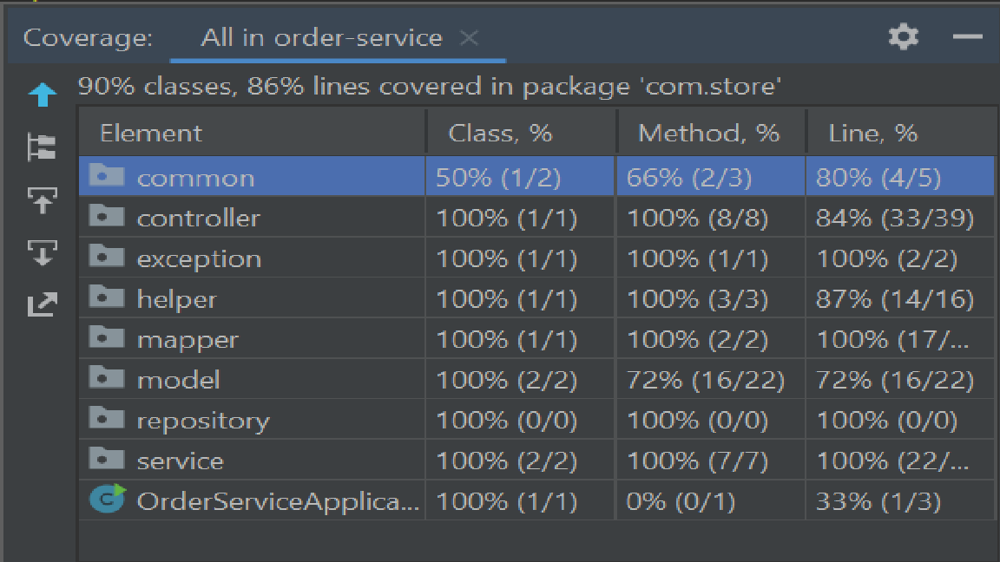

# Spring Boot App to Upload Order CSV Files to store to MySQL database example
# Includes CRUD operations for Order

Steps to Run this application

1. import as maven project

3. change DB credentials in application.properties

4. Build project 
mvn clean install

5. Run OrderServiceApplication class

6. Sample Curl Request
   curl --location --request POST 'localhost:8080/api/v1/orders/upload' \
   --form 'file=@/D:folder/orders.csv'
   
7. postman collection : order-service.postman_collection.json      

Dependencies Used :

1. lombok : to generate getters setters and generate logs
2. spring-data-jpa : ORM tool to map objects with data model
3. commons-csv : Plugin to handle CSV operations

